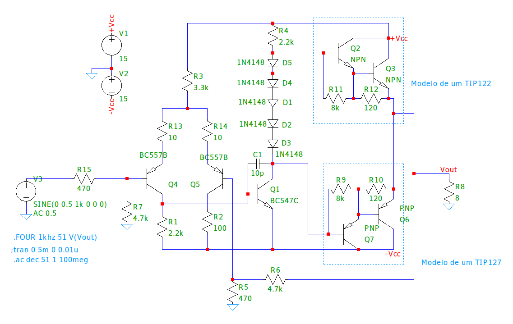

#	🔊	AudioAmpLELT2

    
    

---

Trabalho Prático I - Amplificador de Áudio

O Projeto I tem como objetivo o desenvolvimento de um amplificador de áudio classe AB, cujas especificações se encontram na proposta entregue aos alunos. A metodologia de trabalho tem como ponto de partida a análise e caracterização de um amplificador básico, o qual, a cada aula, será melhorado, a partir de modificações promovidas na topologia de circuitos de cada um dos três estágios que o constituem.

  

---

## Descrição da proposta do Trabalho Prático I:

Neste trabalho cada grupo irá realizar o projeto, simulação, especificação e montagem de um amplificador de áudio para a disciplina. O amplificador a ser montado deverá atender às seguintes especificações mínimas:

- Potência de saída nominal: **10W @ 8Ω**;
- Tensão nominal de alimentação: **+/- 15V**;
- Tensão de offset máxima de saída: **10mV**;
- Capacidade de amplificar sinais de **20 Hz a 20 kHz** sem distorção de fase; 
- Apresentar regulação de linha e de carga inferiores a **1%**; 
- Apresentar Taxa de distorção harmônica total (THD) inferior a **0,01%** para sinais inferiores a **10kHz**; 
- Possuir proteção contra sobrecarga;
- Possuir ajuste de volume; 
- Realizar projeto térmico.

Apenas componentes discretos (Transistores, diodos, resistores, capacitores e indutores) serão aceitos na concepção do projeto.

---

## Desenvolvimento

O desenvolvimento do trabalho se baseará no estudo e caracterização de diferentes topologias de circuitos que poderiam ser empregadas na implementação de cada um dos três estágios básicos de um amplificador de áudio transistorizado, estes sendo: Estágio diferencial de entrada; Estágio amplificador de tensão e Estágio de Potência. Para dar início as discussões, será passada aos alunos uma estrutura inicial de amplificador que deverá ser modificada pelos grupos. Ao final de cada ciclo de aulas, o grupo de alunos irá realizar a caracterização das topologias discutidas em sala e escolher uma dentre elas para a implementação final do projeto. Com isso, gradualmente se determinará a configuração final do amplificador, atendendo aos requisitos descritos na seção anterior.

Uma vez tendo a estrutura do amplificador definida, cada grupo deverá realizar a especificação, orçamento, projeto de placa de circuitos impressos, montagem e teste do amplificador. A apresentação da montagem será marcada pelo professor da disciplina e um relatório final descrevendo todas as etapas do projeto e os resultados obtidos deverá ser entregue até uma semana após a apresentação.

O amplificador projetado e suas etapas de desenvolvimento deverão ser caracterizados via simulação, tendo como base os seguintes parâmetros:

- Razão de Rejeição de Modo Comum (medido em malha aberta);
- Razão de Rejeição de Ruído de Fonte (em malha fechada);
- Ganho em malha aberta;
- Banda passante em malha aberta e fechada;
- Tensão de saturação de saída;
- Tensão de Offset;
- Slew Rate em malha fechada;
- Taxa de distorção harmônica a 1kHz e tensão nominal.
